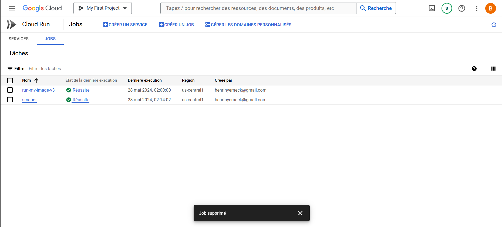
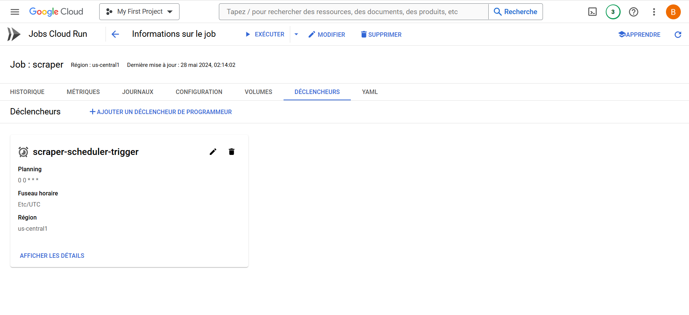
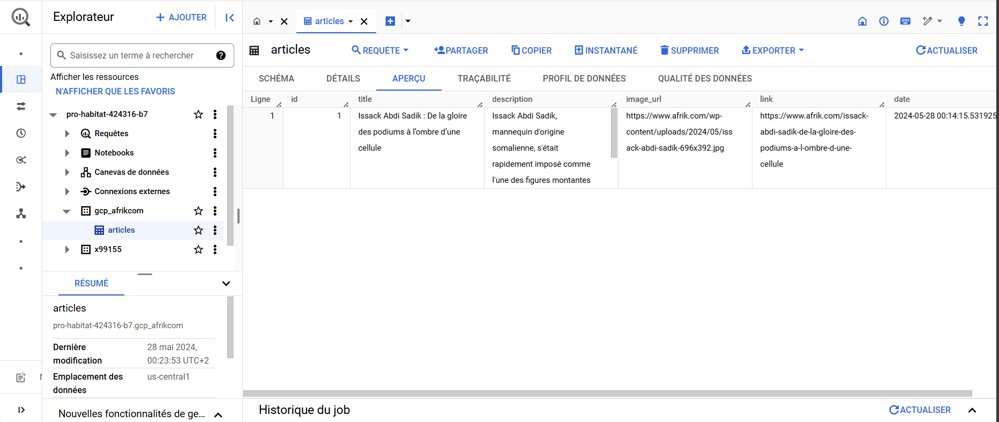

# Projet de Scraping des Articles d'Afrik.com et Stockage dans BigQuery

Ce projet scrappe les articles du site Afrik.com, les stocke dans BigQuery, et automatise ce processus à l'aide de Cloud Run. L'orchestration se fait avec Docker Compose, et les outils Google Cloud Platform tels que Artifact Registry, Cloud Run et Cloud Scheduler sont utilisés.

## Table des Matières

- [Introduction](#introduction)
- [Architecture](#architecture)
- [Prérequis](#prérequis)
- [Installation](#installation)
- [Etape du projet](#étapes-du-projet)
- [Déploiement sur GCP](#déploiement-sur-gcp)
- [Dépannage](#dépannage)
- [Captures](#captures)

## Introduction

L'objectif de ce projet est de scraper les articles du site Afrik.com, de les stocker dans BigQuery pour une analyse ultérieure et d'automatiser ce processus à l'aide d'Airflow. Docker Compose est utilisé pour orchestrer les services, et les outils Google Cloud Platform tels que Artifact Registry, Cloud Run et Cloud Scheduler sont utilisés pour le déploiement et la gestion des tâches.

## Architecture

- **Scraping** : Utilisation de `requests` et `BeautifulSoup` pour extraire les articles.
- **Stockage** : Stockage des articles dans une table BigQuery.
- **Orchestration** : Docker Compose pour orchestrer les conteneurs Docker.
- **Déploiement** : Artifact Registry pour stocker les images Docker, Cloud Run pour exécuter les conteneurs, et Cloud Scheduler pour déclencher les tâches.

## Prérequis

- Docker
- Docker Compose
- Compte Google Cloud Platform
- Packages Python : `requests`, `BeautifulSoup`, `google-cloud-bigquery`, `lxml`

## Installation

### Cloner le Répertoire

```bash
git clone https://github.com/votre-repo/scraping-afrik-bigquery.git
cd scraping-afrik-bigquery
```

## Etapes du projet

- Scraper les articles avec Python
- Stocker les articles dans BigQuery
- Orchestrer avec Docker Compose
- Déployer et planifier sur GCP

## Déploiement sur GCP

1. Construire et pousser les images Docker vers Artifact Registry
```bash
docker build -t us-central1-docker.pkg.dev/YOUR_PROJECT_ID/my-repo/scraper:latest ./scraper
docker push us-central1-docker.pkg.dev/YOUR_PROJECT_ID/my-repo/scraper:latest

```

2. Déployer le scraper avec Cloud Run
```bash
gcloud run deploy scraper --image=us-central1-docker.pkg.dev/YOUR_PROJECT_ID/my-repo/scraper:latest --platform=managed --region=us-central1 --allow-unauthenticated

```

3. Plannifier l'exécution du scraper avec Cloud Scheduler
```bash
gcloud scheduler jobs create http scraper-job --schedule="0 0 * * *" --uri="https://YOUR_CLOUD_RUN_URL" --http-method=POST --time-zone="YOUR_TIME_ZONE"
```

## Dépannage

### Erreurs rencontrées
- Authentification Google Cloud : Assurez-vous que vous êtes correctement authentifié avec Google Cloud SDK.
- Problèmes de Schéma BigQuery : Vérifiez que les colonnes de votre table BigQuery correspondent aux données que vous insérez.
- Dépendances Python : Assurez-vous que toutes les dépendances sont installées dans votre environnement virtuel.

## Captures



