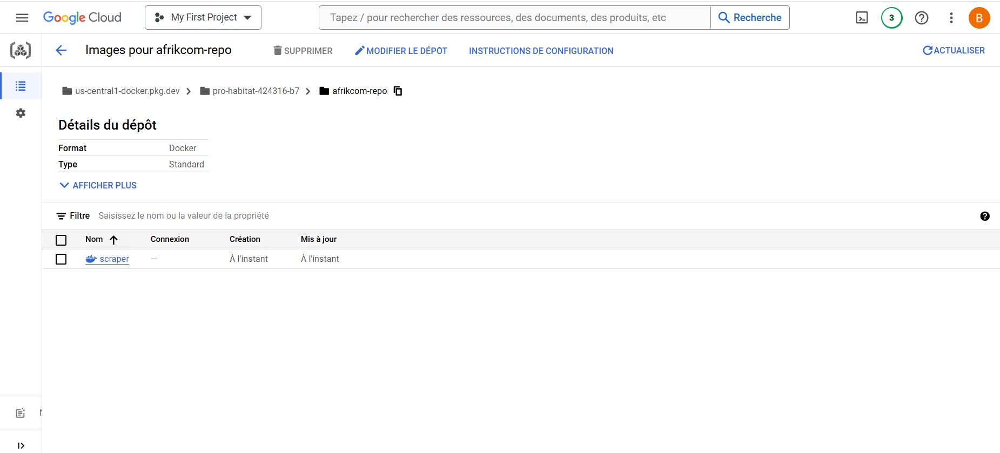

# Projet de Scraping des Articles d'Afrik.com et Stockage dans BigQuery

Ce projet scrappe tous les 3H le dernier article publié sur le site Afrik.com, et le stock dans BigQuery. Le processus est automatisé par Cloud Scheduler

## Table des Matières

- [Introduction](#introduction)
- [Architecture](#architecture)
- [Prérequis](#prérequis)
- [Installation](#installation)
- [Etape du projet](#étapes-du-projet)
- [Déploiement sur GCP](#déploiement-sur-gcp)
- [Dépannage](#dépannage)
- [Captures](#captures)

## Introduction

L'objectif de ce projet est de scraper les articles du site Afrik.com, de les stocker dans BigQuery pour une analyse ultérieure. Docker est utilisé pour constuire l'image de notre application. GCP Artifact Registry pour stocker notre image. Cloud Run Job pour lancer notre conteneur et Cloud Scheduler pour automatisé le processus tous les 3H.


## Architecture

- **Scraping** : Utilisation de `requests` et `BeautifulSoup` pour extraire les articles.
- **Stockage** : Stockage des articles dans une table BigQuery.
- **Architecture** : Docker pour constuire l'architecture.
- **Déploiement** : Artifact Registry pour stocker les images Docker, Cloud Run Job pour exécuter les conteneurs, et Cloud Scheduler pour déclencher les tâches.

## Prérequis

- Docker
- Compte Google Cloud Platform
- Packages Python : `requests`, `BeautifulSoup`, `google-cloud-bigquery`, `lxml`
- DBeaver: alternative pour gérer vos données. Nécessite une connexion à votre table sur BigQuery

## Installation

### Cloner le Répertoire

```bash
git clone https://github.com/votre-repo/scraping-afrik-bigquery.git
cd scraping-afrik-bigquery
```

## Etapes du projet

- Développement du scraper avec Python
- Constuction de l'image du projet avec Docker
- Stockage, Deploiement et plannification du conteneur sur GCP(Artifact Registry, Cloud Run Job et Cloud Scheduler)


## Déploiement sur GCP

1. Construire l'image Docker localement
```bash
docker build -t scraper:latest

```

2. Lier l'image précément crée à votre projet repo Artifact registry
```bash
docker tag scraper:latest us-central1-docker.pkg.dev/pro-habitat-424316-b7/afrikcom-repo/scraper-image

```

3. Pusher l'image vers Artifact Registry
```bash
docker push us-central1-docker.pkg.dev/pro-habitat-424316-b7/afrikcom-repo/scraper-image

```

4. Déployer le scraper avec Cloud Run
```bash
gcloud run deploy scraper-image --image=us-central1-docker.pkg.dev/pro-habitat-424316-b7/afrikcom-repo/scaper-image --platform=managed --region=us-central1 --allow-unauthenticated

```

5. Plannifier l'exécution du scraper avec Cloud Scheduler
```bash
gcloud scheduler jobs create http scraper-job --schedule="0 */3 * * *" --uri="https://YOUR_CLOUD_RUN_URL" --http-method=POST --time-zone="YOUR_TIME_ZONE"
```

Dans mon cas j'ai plannifier l'exécution de mon Job tous les 3 heures UTC

6. Vous pouvez ensuite accéder à BigQuery et vous verrez les données

NB: Vous pouvez aussi exécuter les deux dernières taches directement sur l'interface Cloud Run

## Dépannage

### Erreurs rencontrées
- Authentification Google Cloud : Assurez-vous que vous êtes correctement authentifié avec Google Cloud SDK.
- Problèmes de Schéma BigQuery : Vérifiez que les colonnes de votre table BigQuery correspondent aux données que vous insérez.
- Dépendances Python : Assurez-vous que toutes les dépendances sont installées dans votre environnement virtuel.

## Captures



